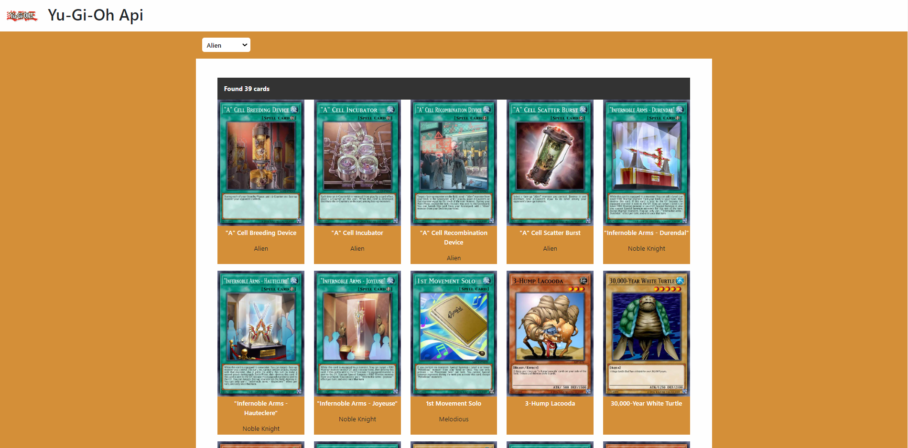

<!-- # Vue 3 + Vite

This template should help get you started developing with Vue 3 in Vite. The template uses Vue 3 `<script setup>` SFCs, check out the [script setup docs](https://v3.vuejs.org/api/sfc-script-setup.html#sfc-script-setup) to learn more.

## Recommended IDE Setup

- [VS Code](https://code.visualstudio.com/) + [Volar](https://marketplace.visualstudio.com/items?itemName=Vue.volar) (and disable Vetur) + [TypeScript Vue Plugin (Volar)](https://marketplace.visualstudio.com/items?itemName=Vue.vscode-typescript-vue-plugin). -->

# Yu-Gi-Oh

> Utilizzando API recuperare info carte

## TECNOLOGIE e LIBRERIE:

- Html
- Scss
- Bootstrap
- Vue 3
- Vite
- Axios

## OBIETTIVO:

Definire i componenti necessari per strutturare il layout.
Al caricamento della pagina, effettuate una chiamata all'API di Yu-Gi-Oh.
Con i dati restituiti stampate una card per ogni carta, trasferendo i dati tramite `State`.

## Bonus:

Creare un componente loader da visualizzare fino a quando i risultati non siano pronti.
